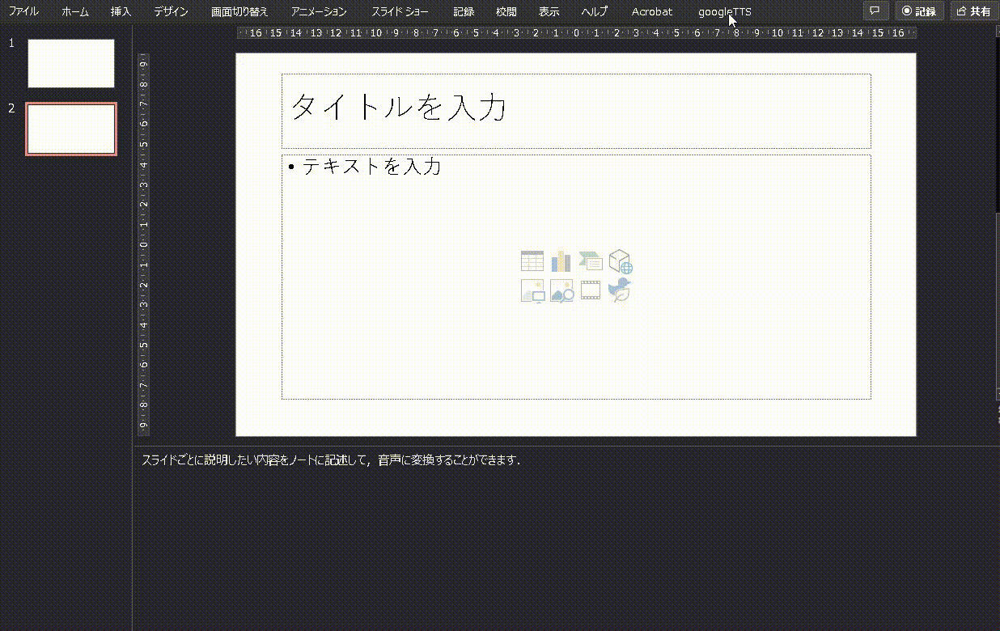
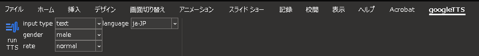

## 概要

Microsoft365のPowerpointは動画作成も容易になっており，素晴らしいのですが，基本的には人がしゃべる前提になっており，テキストから音声データを作成することはできません．  

プレゼンが苦手な人や，匿名で動画作成したい人にとっては，記述したテキストを音声変換して，サクッとプレゼン用音声や動画作成として活用したいのではないか，と思い，GoogleTTSをアドインとして実装しましたので紹介します．  
  
こんな感じでワンクリックで，スライドごとに設けられているノートを音声に変換することができます．



リボンも実装していまして，入力タイプ（テキストかSSMLか），音声の性別，発話の速度，言語を選択することができます．



これなら何回もやり直すことはできますし，何よりGoogleTTSは無料枠が大きいので，普通の使い方をしていれば**ほぼ無料**で利用することができます．

## 詳細

基本的にはRest APIにリクエストを投げて，結果をPowerpointに貼り付けているだけです．  
ただそれだと味気ないのでそれぞれ説明していきます．

### Google TTS

[Google Text-to-Speech](https://cloud.google.com/text-to-speech)  
  
Rest APIのリファレンスは[こちら](https://cloud.google.com/text-to-speech/docs/reference/rest/v1/text/synthesize)です．  
  
vbaでリスエストして，取得することになるのですが，いくつか課題があります．
  
まず，vbaにデフォルトでjsonデータを作成するライブラリが存在しません．  
ですので自作する必要があるのですが，奇特な人がいて，JsonConverterなるライブラリがGitHubで公開されています．
  
https://github.com/VBA-tools/VBA-JSON  
  
これでpayloadを作成して，APIに投げます．  
  
また，音声ファイルを直接受け取ることができません．  
そこで，リニア PCM（ LINEAR16 ）と呼ばれる文字列で受け取り，それをバイナリに変換し，wavファイルとして取得することにしました．

以下にAPIにアクセスするコードを掲載します．

```vb:Google_TTS.bas
Public Function GoogleTextToSpeech( _
    ByRef myNote As String, _
    ByRef inputType As String, _
    ByRef name As String, _
    ByRef language As String, _
    ByRef speakingRate As Single, _
    ByRef pitch As Single _
    ) As Variant

    'APIとやり取りするためのデータをDictionary型で作る（後でJSONに変換）
    'audioConfig
    Dim AudioConfig As Object
    Set AudioConfig = New Dictionary
    AudioConfig.Add "audioEncoding", "LINEAR16"
    AudioConfig.Add "speakingRate", speakingRate
    AudioConfig.Add "pitch", pitch

    'input
    Dim AudioInput As Object
    Set AudioInput = New Dictionary
    AudioInput.Add inputType, myNote

    'voice
    Dim AudioVoice As Object
    Set AudioVoice = New Dictionary
    AudioVoice.Add "languageCode", language
    AudioVoice.Add "name", name

    'Jsonオブジェクトを作成
    Dim JsonObject As Object
    Set JsonObject = New Dictionary
    JsonObject.Add "audioConfig", AudioConfig
    JsonObject.Add "input", AudioInput
    JsonObject.Add "voice", AudioVoice

    'API実行
    Dim objHTTP As Object
    Dim uri As String
    Dim response As Variant
    Dim res As Object
    Dim Choices As Variant
    Set objHTTP = CreateObject("msxml2.xmlhttp")
    uri = GOOGLE_TEXT_TO_SPEECH_API_URI & "?key=" & API_KEY
    objHTTP.Open "POST", uri, False
    objHTTP.setRequestHeader "Content-Type", "application/json"
    objHTTP.send JsonConverter.ConvertToJson(JsonObject)

    'レスポンスコードのチェック(正常)
    If objHTTP.Status <> 200 Then
        GoogleTextToSpeech = False
        Exit Function
    End If

    response = objHTTP.responseText

    'レスポンスJSONを辞書型に変換する
    Set res = ParseJson(response)
    'レスポンスの中から質問への回答を取り出して、戻り値とする
    Choices = res("audioContent")
    GoogleTextToSpeech = Choices
End Function
```

### スライドへの音声埋め込み

手動でスライドに音声データを埋め込む手順と同様に，ファイルの外から音声ファイルを埋め込む必要があります．  
そこで，一旦一時ファイルに音声ファイルを作成して，そのファイルをスライド内に埋め込み，完了したら一時ファイルを削除しています．  
  
以下に全体の流れを掲載します．

```vb
Private Function VbaTextToSpeech( _
    ByRef myNote As String, _
    Optional inputType As String = "text", _
    Optional gender As String = "male", _
    Optional speakingRate As String = "normal", _
    Optional pitch As Single = 0#, _
    Optional language As String = "ja-JP" _
    )
    Dim name As String
    Dim rate As Single

    name = getName(gender, language)
    rate = getRate(speakingRate)

    VbaTextToSpeech = Google_TTS.GoogleTextToSpeech(myNote, inputType, name, language, rate, pitch)
End Function

Public Sub EmbedVoice()
    On Error GoTo MyErr

    ' 現在のスライド番号を取得
    Dim slideIndex As Integer
    slideIndex = ActiveWindow.Selection.SlideRange.slideIndex

    ' 現在のスライドのノートを取得
    Dim myNote As String
    myNote = ActivePresentation.Slides(slideIndex).NotesPage.Shapes.Placeholders(2).TextFrame.TextRange.Text

    ' 一時フォルダを取得
    Dim tempPath As String
    tempPath = Environ("TEMP")

    ' wavファイルのパスを作成
    Dim wavePath As String
    wavePath = tempPath & "\voice.wav"

    ' 実行前の確認
    If MyMessages.askToRun = vbNo Then
        Exit Sub
    End If

    ' wavファイルがスライド内に既にあれば削除
    Dim fso As Object
    Set fso = CreateObject("Scripting.FileSystemObject")
    If fso.FileExists(wavePath) Then Kill wavePath

    ' 音声の文字列データを取得
    Dim output As Variant
    output = VbaTextToSpeech( _
        myNote, _
        ribbonInputType, _
        ribbonGender, _
        ribbonSpeakingRate, _
        ribbonPitch, _
        ribbonLanguage _
    )
    If output = False Then
        Call MyMessages.failToRunTextToSpeech
        Exit Sub
    End If

    ' wavファイルに保存
    If decodeBase64(output, wavePath) = False Then
        Call MyMessages.failToDecode
        Exit Sub
    End If

    ' audioオブジェクトの埋め込み
    Dim oSlide As Slide
    Dim oShp As Shape
    Dim oEffect As Effect

    With ActivePresentation.Slides(slideIndex).Shapes.AddMediaObject2(wavePath, False, True, 10, 10)
        With .AnimationSettings.PlaySettings
            .PlayOnEntry = True
            .HideWhileNotPlaying = True
        End With
    End With

    ' wavファイルの削除
    fso.DeleteFile wavePath

    Call MyMessages.success
    Exit Sub

MyErr:
    Call MyMessages.unknown
End Sub
```

## リボン

リボンはCustom UI Editor Toolでカスタマイズしました．

[Custom UI Editorの最新版がGitHubで公開されました。](https://www.ka-net.org/blog/?p=8945)

カスタムしたリボンの値は，Powerpointを立ち上げた際に紐付けます．

```vb:CustomUI.bas
Option Explicit

#If VBA7 And Win64 Then
   Private Declare PtrSafe Sub MoveMemory Lib "kernel32" Alias "RtlMoveMemory" (pDest As Any, pSrc As Any, ByVal cbLen As LongPtr)
 #Else
   Private Declare Sub MoveMemory Lib "kernel32" Alias "RtlMoveMemory" (pDest As Any, pSrc As Any, ByVal cbLen As Long)
 #End If

Private RibbonUI As IRibbonUI

Public ribbonInputType As String
Public ribbonGender As String
Public ribbonSpeakingRate As String
Public ribbonPitch As Single
Public ribbonLanguage As String

Public Sub ribbon_onLoad(ribbon As IRibbonUI)
    
    Set RibbonUI = ribbon
    SaveSetting "RibbonApp", "Main", "RibbonPointer", CStr(ObjPtr(ribbon)) 'リボンのポインタをレジストリに記録
    Dim rCtrl As IRibbonControl
    
    ribbonInputType = "text"
    ribbonGender = "male"
    ribbonSpeakingRate = "normal"
    ribbonPitch = 0#
    ribbonLanguage = "ja-JP"
    
    RibbonUI.Invalidate
End Sub

Private Sub SampleTab_getVisible(control As IRibbonControl, ByRef returnedVal)
    '常にタブを表示する
    returnedVal = True
End Sub

Public Sub ResetRibbon()
 #If VBA7 And Win64 Then
    Set RibbonUI = GetRibbon(CLngPtr(GetSetting("RibbonApp", "Main", "RibbonPointer")))
  #Else
    Set RibbonUI = GetRibbon(CLng(GetSetting("RibbonApp", "Main", "RibbonPointer")))
  #End If
End Sub

#If VBA7 And Win64 Then
 Private Function GetRibbon(ByVal lRibbonPointer As LongPtr) As Object
   Dim p As LongPtr
 #Else
 Private Function GetRibbon(ByVal lRibbonPointer As Long) As Object
   Dim p As Long
 #End If
   Dim ribbonObj As Object
   MoveMemory ribbonObj, lRibbonPointer, LenB(lRibbonPointer)
   Set GetRibbon = ribbonObj
   p = 0: MoveMemory ribbonObj, p, LenB(p)
End Function
```

イベント検知はこんな感じです．

```vb:Group.bas
Option Explicit

Public Sub btn_googleTTS_onAction(control As IRibbonControl)
    On Error GoTo MyErr
    Call Module_TTS.EmbedVoice
    Exit Sub

MyErr:
    Call ResetRibbon
End Sub

Public Sub ddnInputType_getSelectedItemID(control As IRibbonControl, ByRef returnedVal)
  returnedVal = ribbonInputType
End Sub

Public Sub ddnInputType_onAction(control As IRibbonControl, id As String, index As Integer)
    On Error GoTo MyErr
    ribbonInputType = id
MyErr:
    Call ResetRibbon
End Sub

Public Sub ddnGender_getSelectedItemID(control As IRibbonControl, ByRef ReturnValue)
    ReturnValue = ribbonGender
End Sub

Public Sub ddnGender_onAction(control As IRibbonControl, id As String, index As Integer)
    On Error GoTo MyErr
    ribbonGender = id
MyErr:
    Call ResetRibbon
End Sub

Public Sub ddnSpeakingRate_getSelectedItemID(control As IRibbonControl, ByRef ReturnValue)
    ReturnValue = ribbonSpeakingRate
End Sub

Public Sub ddnSpeakingRate_onAction(control As IRibbonControl, id As String, index As Integer)
    On Error GoTo MyErr
    ribbonSpeakingRate = id
MyErr:
    Call ResetRibbon
End Sub

Public Sub ddnLanguage_getSelectedItemID(control As IRibbonControl, ByRef ReturnValue)
    ReturnValue = ribbonLanguage
End Sub

Public Sub ddnLanguage_onAction(control As IRibbonControl, id As String, index As Integer)
    On Error GoTo MyErr
    ribbonLanguage = id
MyErr:
    Call ResetRibbon
End Sub
```

Google TTSを使うととても自然な音声を生成できるので，とてもおすすめです．
参考になれば幸いです．