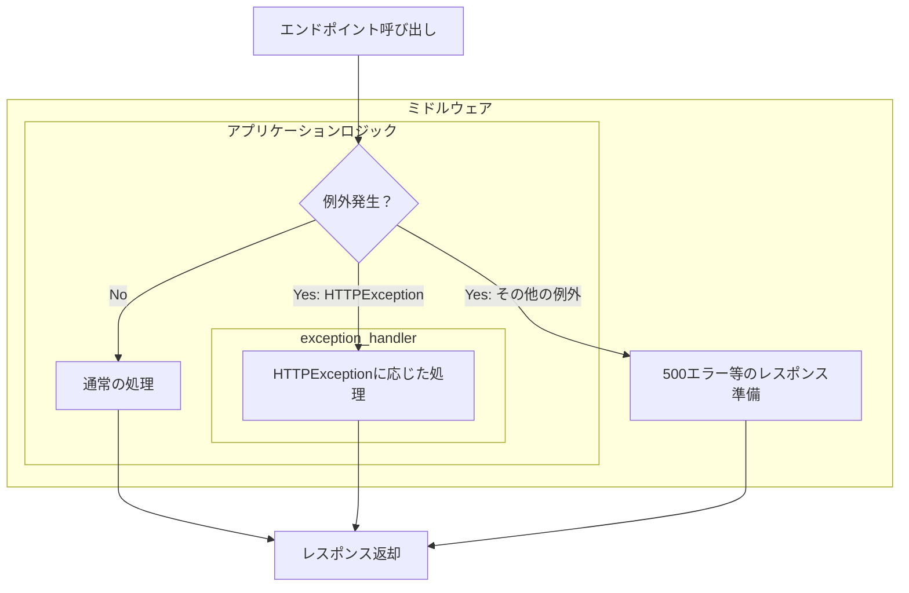

## 概要

この記事はFastAPI初心者が例外ハンドラを理解するために調べた内容のメモです。  
FastAPIでは、エンドポイント内で発生した例外に対して適切なレスポンスを返すため、例外ハンドラとミドルウェアがそれぞれ異なる役割を担っています。  
この記事では、その違いと役割について整理します。

## FastAPIの例外処理

FastAPIでは、エンドポイント内で発生した例外は、通常は例外ハンドラ（`add_exception_handler`で登録）で処理されます。  
一方、予期しない例外はミドルウェア（`add_middleware`で登録）で捕捉され、500エラーなどとして処理されます。  
以下は、その処理の流れを示したフローチャートです。



HTTPExceptionは、内部で処理するか例外ハンドラで処理され、その他の例外はミドルウェアで処理されます。  
これにより、通常のエラーと意図しないエラーを分けて処理でき、ログの管理やデバッグが容易になります。

## 確認

以下の構成でFastAPIを動かします。  
詳細はgithubにアップしています。  
https://github.com/kicchann/fastapi_exception_handling

```plaintext
app
 ┣ src
 ┃ ┣ exception_handler.py
 ┃ ┗ main.py
 ┣ Dockerfile
 ┣ docker-compose.yaml
 ┗ requirements.txt
 ```

`main.py`

```python
from fastapi import FastAPI
from fastapi.exceptions import HTTPException

from exception_handler import (
    CustomHTTPException,
    ExceptionMiddleware,
    custom_http_exception_handler,
)

app = FastAPI()

app.add_middleware(ExceptionMiddleware)

app.add_exception_handler(CustomHTTPException, custom_http_exception_handler)


# ルートパスへのアクセス
@app.get("/")
def read_root():
    return {"Hello": "World"}


@app.get("/exception")
def raise_exception():
    raise Exception("Test Exception")


@app.get("/http_exception")
def raise_http_exception():
    raise HTTPException(status_code=404, detail="Not Found")


if __name__ == "__main__":
    import uvicorn

    uvicorn.run(
        "main:app",
        host="0.0.0.0",
        port=8080,
        reload=True,
    )
```

`exception_handler.py`

```python
from fastapi import HTTPException, Request, status
from fastapi.responses import JSONResponse
from starlette.middleware.base import BaseHTTPMiddleware
from starlette.types import ASGIApp


# 未処理のエラーハンドリングを行うミドルウェア
class ExceptionMiddleware(BaseHTTPMiddleware):
    def __init__(self, app: ASGIApp):
        super().__init__(app)

    async def dispatch(self, request: Request, call_next):
        try:
            response = await call_next(request)
            return response
        except Exception as exc:
            # ここでログ出力などの何かしら処理を行う
            return JSONResponse(
                status_code=status.HTTP_500_INTERNAL_SERVER_ERROR,
                content={"error": "Internal Server Error", "detail": str(exc)},
            )


# ロジック内で捕捉した例外を扱うためのクラス
class CustomHTTPException(HTTPException):
    def __init__(self, status_code: int, detail: str):
        super().__init__(status_code=status_code, detail=detail)
        # ここでログ出力などの何かしら処理を行う


def custom_http_exception_handler(request: Request, exc: CustomHTTPException):
    return JSONResponse(
        status_code=exc.status_code,
        content={
            "error": "Custom HTTP Exception",
            "detail": exc.detail,
        },
    )
```

## 例外処理の動作確認

この状態で、`http://localhost:8080/exception`にアクセスすると、以下のようなレスポンスが返ってきます。

```json
{
  "error": "Internal Server Error",
  "detail": "Test Exception"
}
```

一方で、`http://localhost:8080/http_exception`にアクセスすると、以下のようなレスポンスが返ってきます。

```json
{
  "error": "Custom HTTP Exception",
  "detail": "Not Found"
}
```

## 参照したサイト

https://www.starlette.io/exceptions/#errors-and-handled-exceptions